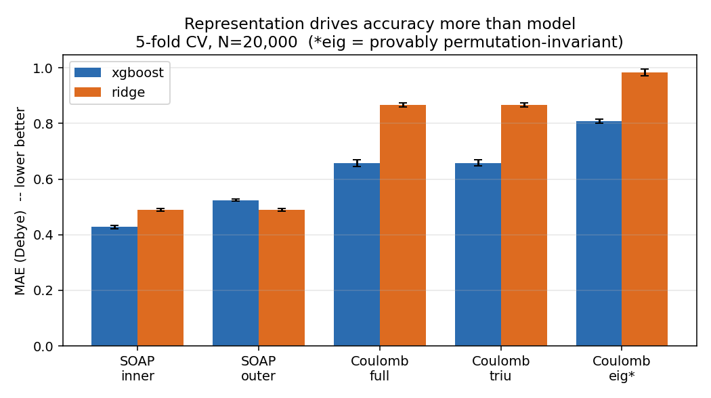
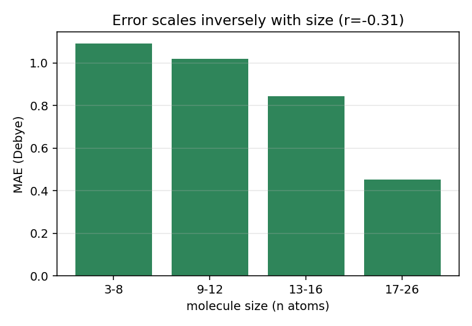

# Representation vs. Model in Molecular Dipole-Moment Prediction: A Controlled Study

**Question.** For predicting molecular dipole moments from 3D structure, what
matters more — the *molecular representation* (how atoms are encoded) or the
*learning model*? And is the widely-assumed **permutation invariance** of a
representation actually the property that drives accuracy?

**TL;DR.** Under a single, paired 5-fold cross-validation protocol on 20,000
molecules, **representation dominates model by roughly 3×**, and — contrary to
the common intuition — **enforcing exact permutation invariance *hurts*
accuracy**. Local-environment richness, not symmetry, is the real driver.

---

## 1. Data & protocol

- **Dataset:** 20,000 labeled molecules (QM9-style, elements H/C/N/O/F),
  molecule sizes 3–26 atoms. Dipole moment (Debye) as the regression target.
  A separate 5,000-molecule competition test set has hidden labels, so **all
  evaluation is 5-fold cross-validation on the 20k labeled set**.
- **Protocol:** `KFold(n_splits=5, shuffle=True, random_state=42)`. Every
  representation and model sees **identical folds**, so all comparisons are
  paired. Metrics reported as **mean ± std across folds** (MAE in Debye, R²).
- **Preprocessing:** zero-variance columns (padding for molecules < 29 atoms in
  the Coulomb representations) are dropped *inside each fold* before
  standardization — otherwise `StandardScaler` divides by zero and silently
  corrupts the linear baseline. Featurization is cached and reused across all
  experiments.

## 2. Representations

All Coulomb representations derive from the 29×29 Coulomb matrix
(`permutation="sorted_l2"`):

| Name | Dim | Description |
|---|---|---|
| `SOAP-inner` | 5740 | Smooth Overlap of Atomic Positions, inner-averaged to a molecule vector |
| `SOAP-outer` | 5740 | SOAP, outer-averaged (different pooling of atomic power spectra) |
| `Coulomb full` | 841 | flattened matrix |
| `Coulomb triu` | 435 | upper triangle (drops redundant symmetric half) |
| `Coulomb eig` | 29 | **sorted eigenvalue spectrum — provably permutation-invariant** |

`Coulomb eig` is the scientific control: the eigenspectrum of the Coulomb
matrix is invariant to atom ordering *by construction*. If permutation
invariance were the bottleneck, this representation should win.

**Models:** XGBoost (`n_estimators=600, max_depth=6, lr=0.05`,
`reg:absoluteerror`) and Ridge (`alpha=10`) — a strong nonlinear learner and a
linear baseline, fixed across every representation.

## 3. Results



| Representation | Dim | XGBoost MAE | XGBoost R² | Ridge MAE | Ridge R² |
|---|---:|---:|---:|---:|---:|
| **SOAP-inner** | 5740 | **0.428 ± 0.005** | **0.810** | 0.489 ± 0.006 | 0.785 |
| SOAP-outer | 5740 | 0.524 ± 0.004 | 0.734 | 0.489 ± 0.005 | 0.795 |
| Coulomb full | 841 | 0.658 ± 0.012 | 0.591 | 0.866 ± 0.007 | 0.427 |
| Coulomb triu | 435 | 0.658 ± 0.011 | 0.592 | 0.866 ± 0.008 | 0.423 |
| Coulomb eig | 29 | 0.809 ± 0.007 | 0.463 | 0.984 ± 0.012 | 0.291 |

## 4. Findings

**(1) Representation ≫ model.** Swapping the descriptor Coulomb → SOAP (holding
XGBoost fixed) cuts MAE **0.658 → 0.428 = 35%**. Swapping the model
Ridge → XGBoost (holding SOAP-inner fixed) cuts MAE **0.489 → 0.428 = 12%**. The
representation effect is ~3× the model effect. Most strikingly, **linear
regression on SOAP (0.489) beats gradient-boosted trees on Coulomb (0.658)** —
the encoding carries more signal than the learner's capacity.

**(2) Permutation invariance is *not* the driver — enforcing it hurts.** The
provably invariant eigenspectrum gives the **worst** XGBoost result
(0.809 vs 0.658 for the raw sorted matrix), a **+0.15 MAE** degradation,
**paired-t p = 2.3×10⁻⁵**. Collapsing the matrix to its spectrum guarantees
invariance but discards the off-diagonal geometry (relative atomic positions);
that information loss outweighs any benefit of exact symmetry. **Conclusion:
representational richness and locality — captured by SOAP's local atomic
environments — drive accuracy, not invariance per se.** This directly refutes
the intuitive "make it permutation-invariant and it will generalize" hypothesis.

**(3) Aggregation matters, and interacts with the model.** SOAP inner vs outer
pooling: for XGBoost, inner (0.428) clearly beats outer (0.524); for the linear
model the two are equivalent (~0.489). So *how* atom-level features are pooled is
worth ~0.10 MAE to a strong model — comparable to changing the model itself.

**(4) Error scales inversely with molecule size** (r = −0.31).



| n atoms | 3–8 | 9–12 | 13–16 | 17–26 |
|---|---|---|---|---|
| MAE | 1.09 | 1.02 | 0.84 | 0.45 |

Small molecules are *harder*: fewer atoms give a sparser descriptor and higher
per-structure dipole variance, so the model has less to condition on.

## 5. Limitations & future work

- CV is on the 20k labeled subset; the 5k hidden-label set is used only for the
  Kaggle-style submission, not for these conclusions.
- The rigorous CV benchmark covers XGBoost + Ridge across representations; the
  PyTorch-Geometric **GNN** and Coulomb-image **CNN** (see `gnn_*.py`,
  `model.py`) are implemented as additional architectures but were evaluated on
  single splits, not the paired CV protocol — folding them into the same
  protocol is the natural next step.
- Wilcoxon is underpowered at 5 folds (min p = 0.0625); the paired t-test is the
  reported significance. More folds / repeated CV would tighten it.

## 6. Reproduce

```bash
python -m venv research_env && research_env/bin/pip install \
    numpy scipy scikit-learn xgboost dscribe ase matplotlib
research_env/bin/python research_benchmark.py   # Coulomb representations + analysis
research_env/bin/python soap_benchmark.py        # SOAP + aggregation ablation
research_env/bin/python make_figures.py          # figures/
# all numbers land in research_results.json
```
